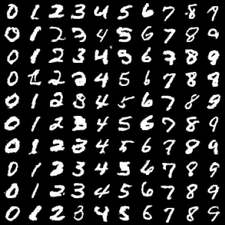
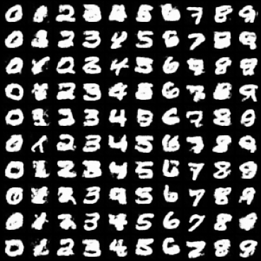
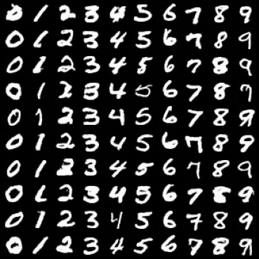
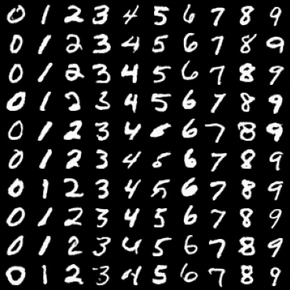
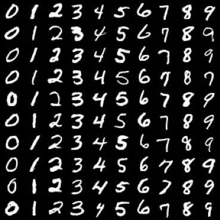

# 🌀 DDPM & DDIM: Denoising Diffusion Probabilistic Models for MNIST

This repository contains an implementation of **DDPM (Denoising Diffusion Probabilistic Models)** and **DDIM (Denoising Diffusion Implicit Models)** using PyTorch. It was developed as part of the MSc Data Science course on Generative Models.

The project trains a diffusion model on the MNIST dataset, logs MSE loss over training epochs, and generates image samples using both DDPM and DDIM with various step counts.


*Image Source: [Somsuvra Chatterjee on LinkedIn](https://www.linkedin.com/pulse/part-1-how-diffusion-models-work-generative-somsuvra-chatterjee-lowzf/)*


---

## 📁 Project Structure

```
.
├── data/                        # Downloaded MNIST data
├── model/
│   ├── DDPM.py                  # DDPM logic and sampling
│   └── UNet.py                  # UNet model architecture
├── samples/                     # Generated sample images & loss plots
├── main.py                      # Main training and sampling script
├── ddpm_loss_plot.png           # Plot of MSE loss over epochs
├── Generative_Models_Ex3_Diffusion.pdf  # Project report
```

---

## 🧠 Model Summary

- **DDPM**: Implements the forward and reverse diffusion processes using a cosine schedule.
- **UNet**: The neural network architecture used for noise prediction.
- **DDIM**: Deterministic sampling from the trained DDPM using fewer steps.
- **Conditional Generation**: The model generates digits conditioned on class labels (0-9).

---

## 🧪 Training

Train the model for 30 epochs on MNIST:

```bash
python main.py --batch_size 128 --epochs 30 --lr 0.001
```

---

## 📊 Evaluation

- **Loss Curve**: Logged and saved after training (`ddpm_loss_plot.png`)
- **DDPM Samples**: Generated after full diffusion process (`MNIST_29.png`)
- **DDIM Samples**: Sampled using 5, 10, 20, 50 timesteps (`DDIM_*.png`)

---


## 🖼️ Generated Samples

<table>
  <tr>
    <th>DDPM (1000 steps)</th>
    <th>DDIM (5 / 10 / 20 / 50 steps)</th>
  </tr>
  <tr>
    <td></td>
    <td>
      
      
      
      
    </td>
  </tr>
</table>


## 📦 Requirements

Install dependencies via:

```bash
pip install -r req.txt
```

---

## 📚 Reference

- Ho, J., Jain, A., & Abbeel, P. (2020). [Denoising Diffusion Probabilistic Models](https://arxiv.org/abs/2006.11239)

---

## 👨‍🎓 Author

**Or Shkuri**  
MSc Data Science  
Assignment 3 — Generative Models Course (2025)